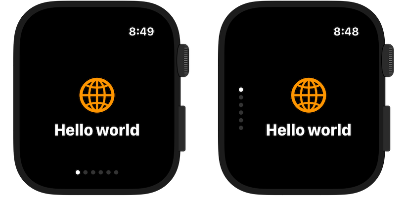
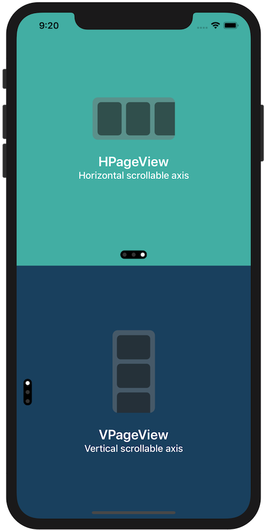
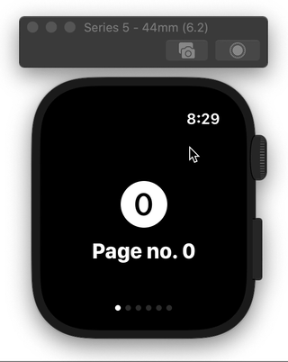
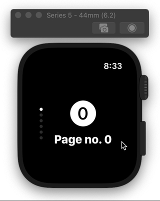

# PageView

SwiftUI view enabling page-based navigation, imitating the behaviour of `UIPageViewController` in iOS.



## Why

SwiftUI doesn't have any kind of paging control component,  with features similar to `UIPageViewController` from UIKit. While on iOS this could be solved by wrapping `UIPageViewController` into  `UIViewRepresentable`, on watchOS horizontal/vertical paging functionality cannot be achieved without using storyboards, which forces developers into using multiple WKHostingControllers.

This package attempts to provide native SwiftUI component for navigation between pages of content.

## Installation

Package requires iOS 14, watchOS 7 and Xcode 12.

### Swift Package Manager

For Swift Package Manager add the following package to your Package.swift:
```swift
.package(url: "https://github.com/fredyshox/PageView.git", .upToNextMajor(from: "1.5.0")),
```

### Carthage


Carthage is also supported, add FormView by adding to Cartfile:
```
github "fredyshox/PageView" ~> 1.5.0
```

## Demo

Demo app for both iOS and watchOS is provided in `Examples/` directory.

## Usage

```swift
import PageView
```

PageView component is available as `HPageView` or `VPageView` depending on scroll direction (horizontal and vertical, respectively). To add paged view with 3 pages use following code:

```swift
@State var pageIndex = 0

...

// horizontal axis
HPageView(selectedPage: $pageIndex) {
    SomeCustomView()
    AnotherCustomView()
    AnotherCustomView()
}

// vertical axis
VPageView(selectedPage: $pageIndex) {
    SomeCustomView()
    AnotherCustomView()
    AnotherCustomView()
}
```

By default PageView fills all the available area, you can constrain it's size using `.frame(width:, height:)` view modifier.

### Selected page binding

Displayed page can be programmatically controled using `Binding`. For example, you can change it, with animation effect using: 

```swift
withAnimation {
  // page index is some State property, which binding was passes into PageView
  self.pageIndex = 2
}
```

### ForEach-style init

PageView supports `ForEach`-like initialization, that is:

```swift
// integer ranges
HPageView(selectedPage: $pageIndex, data: 0..<5) { index in
    SomeCustomView(withIndex: index)
}

// or collection of `Identifiable`
let identifiableArray: [SomeIdentifiableItem] = ...
HPageView(selectedPage: $pageIndex, data: identifiableArray) { item in
    SomeCustomView(withItem: item) 
}

// or any other collection, by specifing id by key-path
let nonIdentifiableArray: [SomeNonIdentifiableItem] = ...
HPageView(selectedPage: $pageIndex, data: nonIdentifiableArray, idKeyPath: \.path.to.id) { item in
    SomeCustomView(withItem: item) 
}
```

### Page switch threshold

You can also control minimum distance that needs to be scrolled to switch page, expressed in fraction of page dimension (width or height, depending on axis). This parameter is called `pageSwitchThreshold`, and must be in range from 0.0 to 1.0.

For iOS the default value is set to `0.3`, while on watchOS `0.5`.

### Gesture type

If PageView gestures are intefering with gestures present on individual pages, PageView's gesture type can be changed by passing `PageGestureType`. Possible values: `.standard`, `.simultaneous`, `.highPriority` (default)

```swift
VPageView(selectedPage: $pageIndex, pageGestureType: .simultaneous) {
    // views 
}
```


### Theme

Styling of page control component can be customized by passing `PageControlTheme`. Customizable properties:

* `backgroundColor`
* `dotActiveColor`: active page dot color
* `dotInactiveColor`: inactive page dot color
* `dotSize`: size of page dot
* `spacing`: spacing between dots
* `padding`: padding of page control
* `xOffset`: page control x-axis offset, used only in vertical mode
* `yOffset`: page control y-axis offset, used only in horizontal mode
* `opacity`: page control opacity in range from 0.0 (invisible) to 1.0 (opaque)
* `alignment`: alignment of page control component (default: bottom-center in horizontal mode, center-leading in vertical mode)

```swift
let theme = PageControlTheme(
    backgroundColor: .white,
    dotActiveColor: .black,
    dotInactiveColor: .gray,
    dotSize: 10.0,
    spacing: 12.0,
    padding: 5.0,
  	xOffset: 8.0,
    yOffset: -8.0,
    opacity: 0.5,
    alignment: Alignment(horizontal: .trailing, vertical: .top)
)
...
VPageView(theme: theme) {
    ...
}
```

There is also a built-in `PageControlTheme.default` style, mimicking `UIPageControl` appearance. To hide it completely use `PageControlTheme.invisible`.

## API

```swift
// Horizontal page view
public struct HPageView<Pages>: View where Pages: View {
    public init(
        selectedPage: Binding<Int>,
        pageSwitchThreshold: CGFloat = .defaultSwitchThreshold,
        pageGestureType: PageGestureType = .highPriority,
        theme: PageControlTheme = .default,
        @PageViewBuilder builder: () -> PageContainer<Pages>
    )
}

// Vertical page view
public struct VPageView<Pages>: View where Pages: View {
    public init(
        selectedPage: Binding<Int>,
        pageSwitchThreshold: CGFloat = .defaultSwitchThreshold,
        pageGestureType: PageGestureType = .highPriority,
        theme: PageControlTheme = .default,
        @PageViewBuilder builder: () -> PageContainer<Pages>
    )
}

public enum PageGestureType {
    case standard, simultaneous, highPriority
}

public struct PageControlTheme {
    public var backgroundColor: Color
    public var dotActiveColor: Color
    public var dotInactiveColor: Color
    public var dotSize: CGFloat
    public var spacing: CGFloat
    public var padding: CGFloat
    public var xOffset: CGFloat
    public var yOffset: CGFloat
    public var opacity: Double
    public var alignment: Alignment?
}
```


## Screenshots







