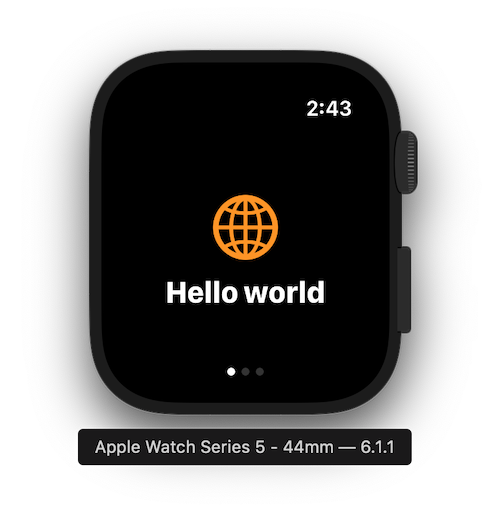
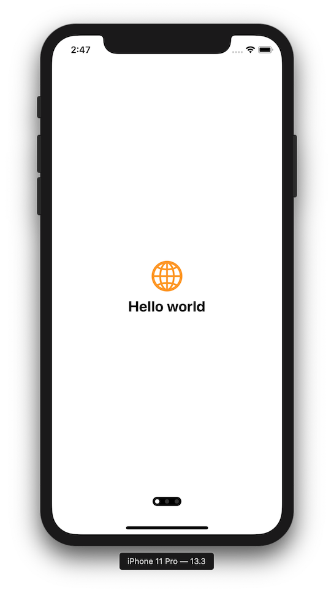

# PageView

SwiftUI view enabling page-based navigation, imitating the behaviour of `UIPageViewController` in iOS.



## Why

SwiftUI doesn't have any kind of paging control component,  with features similar to `UIPageViewController` from UIKit. While on iOS this could be solved by wrapping `UIPageViewController` into  `UIViewRepresentable`, on watchOS horizontal/vertical paging functionality cannot be achieved without using storyboards, which forces developers into using multiple WKHostingControllers.

This package attempts to provide native SwiftUI component for navigation between pages of content.

## Installation

Package requires iOS 13, watchOS 6 and Xcode 11.

### Swift Package Manager

For Swift Package Manager add the following package to your Package.swift:
```swift
.package(url: "https://github.com/fredyshox/PageView.git", .upToNextMajor(from: "1.3.2")),
```

### Carthage


Carthage is also supported, add FormView by adding to Cartfile:
```
github "fredyshox/PageView" ~> 1.3.2
```

## Demo

Demo app for both iOS and watchOS is provided in `Examples/` directory.

## Usage

```swift
import PageView
```

PageView component is available as `HPageView` or `VPageView` depending on scroll direction (horizontal and vertical, respectively).
To add paged view with 3 pages use following code:
```swift
// horizontal axis
HPageView {
    SomeCustomView()
    AnotherCustomView()
    AnotherCustomView()
}

// vertical axis
VPageView {
    SomeCustomView()
    AnotherCustomView()
    AnotherCustomView()
}
```

By default PageView fills all the available area, you can constrain it's size using `.frame(width:, height:)` View modifier.

You can customize the styling of page control component by passing `PageControlTheme`. Customizable properties:
* `backgroundColor`
* `dotActiveColor`: active page dot color
* `dotInactiveColor`: inactive page dot color
* `dotSize`: size of page dot
* `spacing`: spacing between dots
* `padding`: padding of page control
* `xOffset`: page control x-axis offset, used only in vertical mode
* `yOffset`: page control y-axis offset, used only in horizontal mode
* `alignment`: alignment of page control component (default: bottom-center in horizontal mode, center-leading in vertical mode)

```swift
let theme = PageControlTheme(
    backgroundColor: .white,
    dotActiveColor: .black,
    dotInactiveColor: .gray,
    dotSize: 10.0,
    spacing: 12.0,
    padding: 5.0,
  	xOffset: 8.0,
    yOffset: -8.0,
    alignment: Alignment(horizontal: .trailing, vertical: .top)
)
...
VPageView(theme: theme) {
    ...
}
```

There is also a built-in `PageControlTheme.default` style, mimicking `UIPageControl` appearance.

## Screenshots


